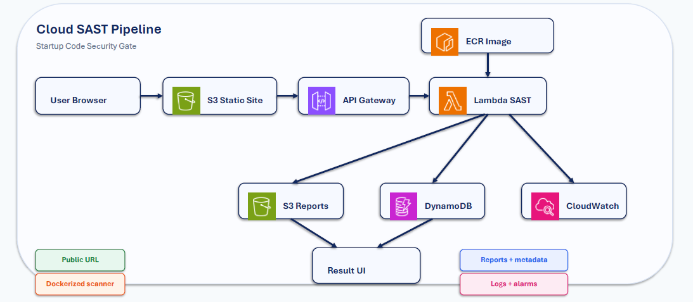

# Startup Code Security Gate

**CS6620 Cloud Computing | Group 9 | Spring 2026**

A serverless SAST (Static Application Security Testing) scanner for JavaScript/Node.js applications. Startup teams can paste code and receive vulnerability reports before deployment.

---

## Team & Work Division

| Role | Owner | Components |
|------|-------|------------|
| **Infrastructure + Backend** | Gideon | DynamoDB, S3, ECR, Lambda (S3/DynamoDB integration, Function URL), CloudWatch & SNS |
| **Frontend + UI** | Rahul | S3 static website, upload form, API integration, result display |

---

## Architecture Overview



---

## AWS Services Used

| Service | Purpose |
|---------|---------|
| ECR | Docker container registry for SAST scanner |
| Lambda | Runs the containerized SAST scanner |
| Lambda Function URL | Public HTTPS endpoint for scan requests |
| DynamoDB | Stores scan metadata (scanId, timestamp, severity counts) with 30-day TTL |
| S3 | Stores full JSON vulnerability reports (30-day lifecycle) |
| CloudWatch & SNS | Logging, metrics, failure alarms, and email alerts |

---

## Infrastructure as Code

All resources are defined in **Terraform modules**:

```
terraform/modules/
├── ecr/          # Container registry
├── s3/           # Report storage + lifecycle rules
├── dynamodb/     # Metadata table
├── lambda/       # SAST scanner function + Function URL
└── monitoring/   # CloudWatch alarms + SNS topic
```

Every resource is tagged with `Group-9` for easy identification.

---

## Deployment

### Prerequisites

- AWS Learner Lab account
- Terraform >= 1.0
- Docker

### Steps

```bash
# Clone the repository
git clone https://github.com/gideon2109/cs6620-startup-code-security-gate.git
cd cs6620-startup-code-security-gate

# Deploy entire stack
./deploy.sh

# Test the deployment
./test-scan.sh
```

### Outputs

After deployment, Terraform outputs:

```bash
terraform output
# ecr_repository_url    = ...
# lambda_function_url   = https://xxxx.lambda-url.us-east-1.on.aws/
# s3_bucket_name        = sast-reports-xxxxxx
# dynamodb_table_name   = sast-scan-metadata
```

---

## Cleanup

```bash
terraform destroy
```
