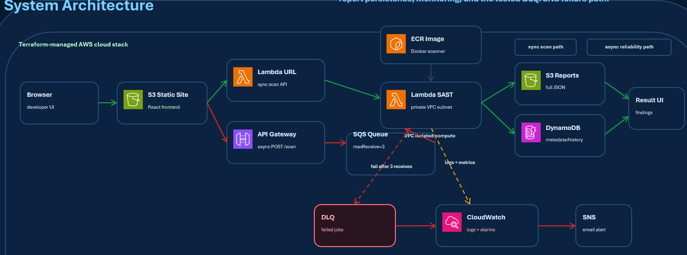

# Startup Code Security Gate

**CS6620 Cloud Computing | Group 9 | Summer 2026**

A serverless SAST (Static Application Security Testing) scanner for JavaScript/Node.js applications. Startup teams can paste code and receive vulnerability reports before deployment.

---

## Team & Work Division

| Role | Owner | Components |
|------|-------|------------|
| **Infrastructure + Backend** | Rahul | DynamoDB, S3, ECR, Lambda (S3/DynamoDB integration, Function URL, VPC), CloudWatch & SNS |
| **Frontend + UI** | Gideon  | S3 static website, upload form, API integration, result display |

---

## Architecture Overview



---

## AWS Services Used

| Service | Purpose |
|---------|---------|
| ECR | Docker container registry for SAST scanner |
| Lambda | Runs the containerized SAST scanner in private VPC subnet |
| Lambda Function URL | Public HTTPS endpoint for synchronous scan requests |
| API Gateway | Async POST /scan for reliability path |
| SQS | Queue with DLQ (maxReceiveCount = 3) |
| DynamoDB | Stores scan metadata (scanId, timestamp, severity counts) with 30-day TTL |
| S3 | Stores full JSON vulnerability reports (30-day lifecycle) |
| CloudWatch & SNS | Logging, metrics, DLQ alarms, and email alerts |
| VPC | Private subnet for Lambda isolation, NAT Gateway for outbound access |

---

## Infrastructure as Code

All resources are defined in **Terraform modules**:

```
terraform/modules/
├── ecr/              # Container registry
├── s3/               # Report storage + lifecycle rules
├── dynamodb/         # Metadata table
├── lambda/           # SAST scanner function + Function URL + VPC config
├── api_gateway/      # API Gateway + SQS integration
├── sqs/              # SQS queue + DLQ + redrive policy
├── monitoring/       # CloudWatch alarms + SNS topic
└── vpc/              # VPC, subnets, NAT Gateway
```

Every resource is tagged with `Group-9` for easy identification.

---

## Deployment

### Prerequisites

- AWS Learner Lab account
- Terraform >= 1.0
- Docker

### Steps

```bash
# Clone the repository
git clone https://github.com/gideon2109/cs6620-startup-code-security-gate.git
cd cs6620-startup-code-security-gate

# Deploy entire stack
./deploy.sh

# Test the deployment (API Gateway → SQS, XML response)
./test-scan.sh

# Test Lambda URL directly (JSON response)
./test-scan-json.sh

# Test DLQ simulation
./scripts/test-dlq-quick.sh
```

### Outputs

After deployment, Terraform outputs:

```bash
terraform output
# ecr_repository_url    = ...
# lambda_function_url   = https://xxxx.lambda-url.us-east-1.on.aws/
# api_gateway_url       = https://xxxx.execute-api.us-east-1.amazonaws.com/scan
# s3_bucket_name        = sast-reports-xxxxxx
# dynamodb_table_name   = sast-scan-metadata
# sns_alerts_topic_arn  = arn:aws:sns:...
```

### Milestone 2 Evidence

| Metric | Value |
|--------|-------|
| Terraform resources | 28 added |
| Normal scan | 6 findings (3 High, 2 Medium, 1 Low) |
| Stress test | 36 findings (25 High, 9 Medium, 2 Low) |
| DLQ reliability test | 3 malformed jobs redriven |
| CloudWatch alarm | OK → ALARM |
| SNS email | Delivered |
| VPC isolation | Lambda in private subnet, NAT Gateway |

### Cleanup

```bash
terraform destroy
```

---

## What Changed

| Addition | Why |
|----------|-----|
| API Gateway + SQS + DLQ | Milestone 2 reliability path |
| VPC + NAT Gateway | Network isolation evidence |
| test-scan-json.sh | JSON response test |
| scripts/test-dlq-quick.sh | DLQ simulation |
| Milestone 2 evidence table | Key metrics at a glance |

---